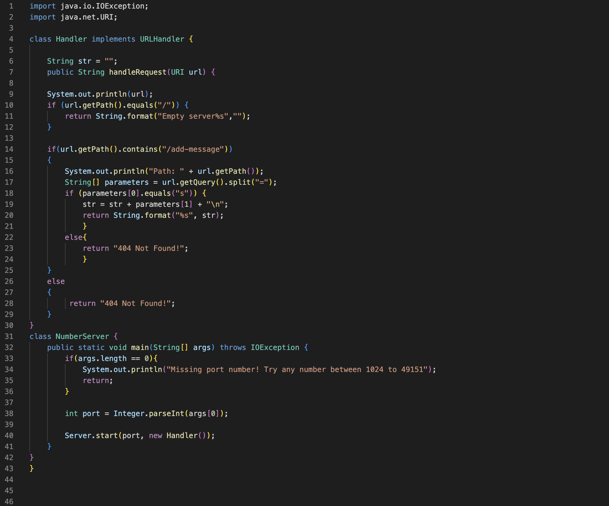
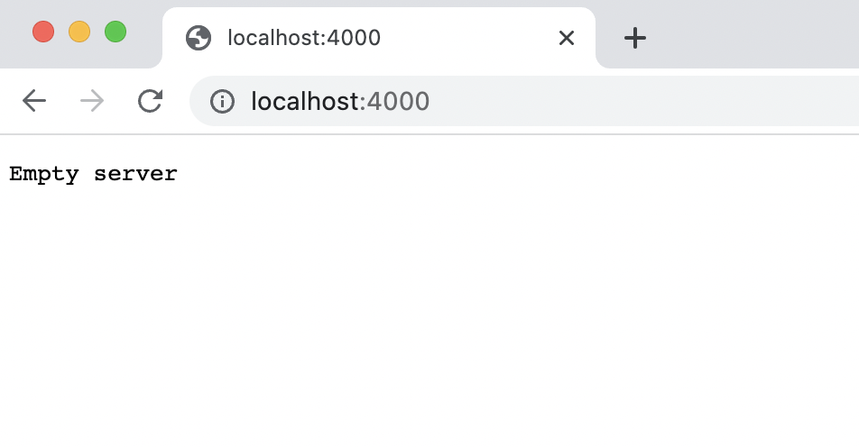
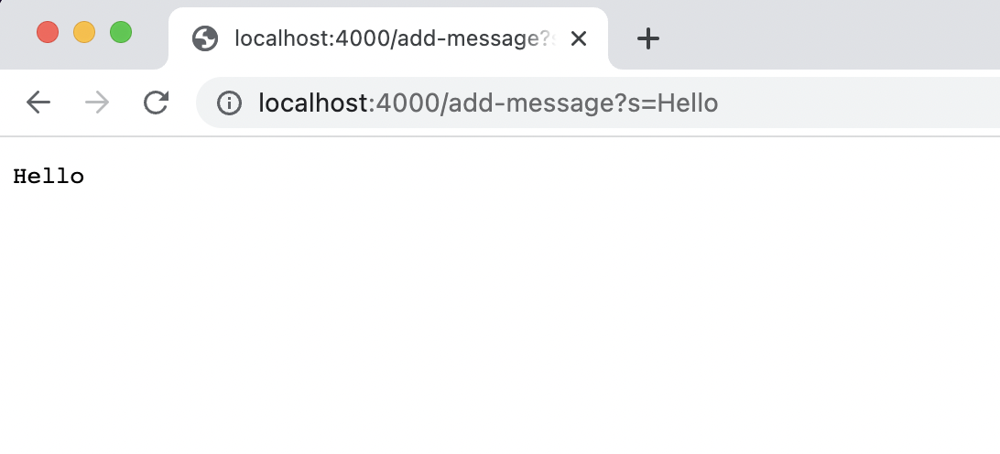
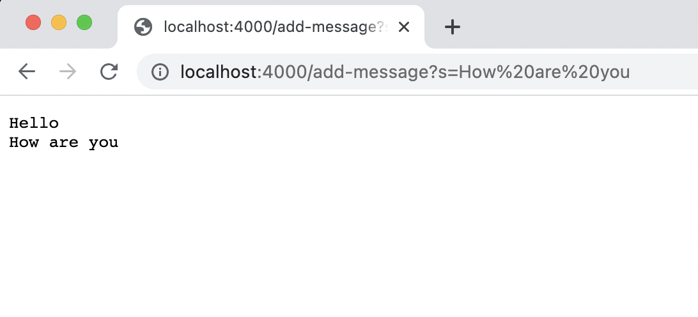
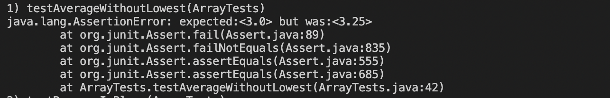
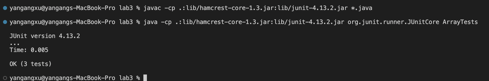

# Lab Reprt 2
# Servers and Bugs




Which methods in your code are called?
```
length
Integer.parseInt()
start()
new Handler()
```


What are the relevant arguments to those methods, and the values of any relevant fields of the class?
```
args
port
```

The method ```length``` is called to check whether the lenth of the arg is zero or not. If the length is zero, the variable ```args``` is empty. If the variable doesn't have any value the server can't be start without port numebr.  ```args[0]``` is a string. it contains the port for the server. The method ```Integer.parseInt()``` is called to convert the value to a integer. Then the method ```start()``` is called to start to a server with the integer value ```port``` and method ```new Handler()``` as parameters. The method ```new Handler()``` will create a new handler.

How do the values of any relevant fields of the class change from this specific request? If no values got changed, explain why.

The vlaue of the variable ```args``` and ```port``` can be change when a new server is starting. the value of ```rgs``` is a input, the ```port``` depends on the value args. It is same as ```args```, but it is a integer.





Which methods in your code are called?

```
url.getPath().equal()

url.getpath().contains()

url.getQuery().split()
```

Thses are methods in my code are called. The getPath method will return the path of the url, then it will compare with ```\``` . If then are same, it will return a message ```Empty server``` on the wed page at beginning. The ```getPath.contains()``` method will check whether the path contains the string ```/add-message```, if it does, it will call ```getQuery.split()``` method to split the url. If ```parameter[0]``` equals ``` s ```, it will add ```parameters[1]``` to the string ```str```. If the the path of url doesn't contain the string ``` /add-message```, it will return ``` 404 Not Found ``` on the web page.
What are the relevant arguments to those methods, and the values of any relevant fields of the class?

```
/

/add-message

=

s

str
```

```str``` is a string variavle. it will add all the element and saparate all of them on each line. It will change if you add a new message in the server. ```/ /add-message = s``` are strings, they are use to do the comparsion.

How do the values of any relevant fields of the class change from this specific request? If no values got changed, explain why.

Value of ```str``` changes from the specific request because every time we add a new string into the server, the value str will add a ```\n``` and the new string to the end of itself. So it changes when you add any new message into the server.


## Part 2

A failure-inducing input for the buggy program, as a JUnit test and any associated code
```
@Test
  public void testAverageWithoutLowest(){
    double[] input = {1, 2, 3, 3, 4};
    assertEquals(3, ArrayExamples.averageWithoutLowest(input), 0.01);
      }
```
JUnit test passing the non failure inducing input


An input that doesn’t induce a failure, as a JUnit test and any associated code
```
@Test
  public void testAverageWithoutLowest(){
    double[] input = {1};
    assertEquals(0, ArrayExamples.averageWithoutLowest(input), 0.01);
      }
```
The symptom, as the output of running the tests (provide it as a screenshot of running JUnit with at least the two inputs above)




The bug, as the before-and-after code change required to fix it (as two code blocks in Markdown)
```
static double averageWithoutLowest(double[] arr) {
    if(arr.length < 2) { return 0.0; }
    double lowest = arr[0];
    for(double num: arr) {
      if(num < lowest) { lowest = num; }
    }
    double sum = 0;
    for(double num: arr) {
       sum += num; 
    }
    return sum / (arr.length - 1);
  }
```

```
static double newAverageWithoutLowest(double[] arr) {
    if(arr.length < 2) { return 0.0; }
    double lowest = arr[0];
    for(double num: arr) {
      if(num < lowest) { lowest = num; }
    }
    double sum = 0;
    for(double num: arr) {
      sum += num; 
    }

    sum = sum - lowest;

    return sum / (arr.length - 1);
  }
```
Briefly describe why the fix addresses the issue.

The before code calculated the sum and lowest correctly, but the main reason which caused the bug is the before code only calculated the sum and lowest. It didn't subtract the lowest from the sum. The after code, I add a calculation that does subtraction. It subtracts the lowest from the sum. For example, the array is 1, 2, 3, 3, 4, and the expected value is 3, but the actual value is 3.25. it's just because the before code didn't subtract the lowest value 1 from the sum.

## Part 3
In a couple of sentences, describe something you learned from lab in week 2 or 3 that you didn’t know before.

I learned how to clone from github, and I use vscode to clone from github to my computer through the git clone command. I learned what makes up a URL in the section on How to distinguish URLs in a URL Domain path Query and Anchor. I also learned about the commands to build and run the server. How to use JUnit for debugging. These are things I didn't know before.


